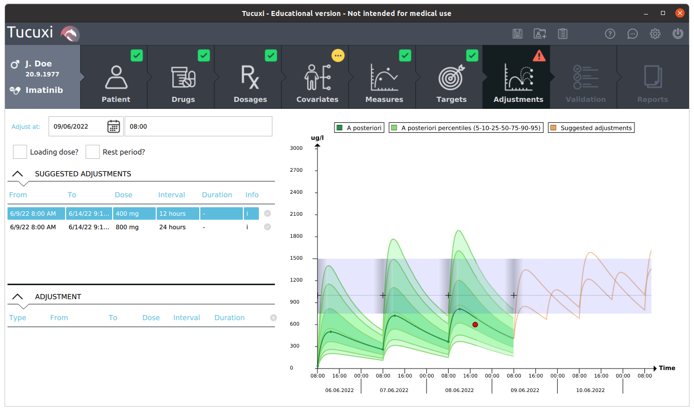

Tucuxi-gui
==========

Description
-----------

Tucuxi is a software for clinical pharmacology and specifically for Therapeutic Drug Monitoring (TDM) and Model Informed Precision Dosing (MIPD), able to compute drug concentration predictions based on the patient's data (dosage history, covariates, blood sample measurements). Tucuxi offers a graphical user interface, and is built on top of a computing engine.

Tucuxi can be accessed froms http://www.tucuxi.ch .

This repo contains the Graphical User Interface, called Tucuxi-gui. The computing engine is available under the same license in a separate repository.

Getting started
---------------

Start with a git clone, with the --recurse-submodules option.

Dependencies
------------

Tucuxi-gui takes advantage of other Open Source projects:

- boost 1.83
- botan 2.19.3
- cxxopts
- date
- eigen 3.3.8
- fructose 1.3
- rapidxml
- rapidjson
- spdlog
- TinyJS
- xerces-c

Currently, the useful code is embedded within our repo. It may change in the future.

Compilation
-----------

Tucuxi has a long history, and so its compilation tools history. The main flow involves ``qmake``, as the GUI has been developed with Qt. In a near future we will move to ``cmake``, so stay tuned.

First, a setup step is required to compile and prepare the libraries.

For Linux and MacOS:

.. code-block:: bash

    ./setup.sh

For Windows:

.. code-block:: bash

    ./setup.bat

Then you are ready for compilation of the Tucuxi GUI.

Compilation of the command line interface
^^^^^^^^^^^^^^^^^^^^^^^^^^^^^^^^^^^^^^^^^

For compilation of *tucuxi*, go into a build folder of your choice, and run the command:

.. code-block:: bash

  qmake <tucuxi-gui_git>/dev/src/tucuxi.pro

Some configuration flags enable to compile different versions:

  - config_demo : Compiles a demo version (not used anymore)
  - config_guitest : Compiles the automated tests
  - config_externalreport : Lets the report template being on the file system
  - config_connected : Compiles with potential connection to an external HL7 database
  - config_rest : Compiles with potential connection to an external HL7 database
  - config_view_preproc : To view the preprocessor output
  - config_disablepercs : Compiles with percentiles computation disabled (could be used for debugging)

The only two that are really useful nowadays are config_guitest and config_externalreport.

One mandatory variable has to be set when launching qmake:

.. code-block:: bash

  DRUGSPATH=<path_to_the_tucuxi_drugs>/tucuxi-drugs/drugfiles

This variable indicates where the drug files are located. After compilation, the makefile will copy the drug files into the destination directory.

Adding the following :code:`DEFINE` statement allows to build an executable that will not ask for a license at startup:

.. code-block:: bash

  DEFINES+=NOLICENSE

Adding the following :code:`DEFINE` statement allows to build an executable that will not show the startup screen:

.. code-block:: bash

  DEFINES+=NOSTARTUPSCREEN

Adding the following :code:`DEFINE` statement allows to build an executable that will not catch exceptions. It can be useful for debugging:

.. code-block:: bash

  DEFINES+=TUCU_NOCATCH

Adding the following :code:`DEFINE` statement allows to build an executable where all the datetime variables embed a string, making debugging easier. It should obviously not be used in release mode, is strongly encouraged for debug:

.. code-block:: bash

  DEFINES+=EASY_DEBUG

The following configuration allows to use HTML reports accessible through the file system:

.. code-block:: bash

  CONFIG+=config_externalreport

The following configuration builds GUI tests that launch automatic tests:

.. code-block:: bash

  CONFIG+=config_guitest

The following configuration builds the GUI but disables the percentiles calculation. It can be useful during development to speed up calculations :

.. code-block:: bash

  CONFIG+=config_disablepercs

A typical example of build, executed from :file:`<path_to_tucuxi-gui_git>/dev/src` would be:

.. code-block:: bash

  qmake DEFINES+=NOLICENSE DEFINES+=NOSTARTUPSCREEN DRUGSPATH=<...>/tucuxi-drugs/drugfiles CONFIG+=config_externalreport
  make
  make install

qmake is also waiting for one variable:

.. code-block:: bash

  DRUGSPATH=<path_to_a_drugfile_folder>

It should point to a folder in which are drug files. It mandatory.

Some defines can be used to generate different versions:

.. code-block:: bash
  DEFINES+=NOLICENSE

 DEFINES+=NOSTARTUPSCREEN DRUGSPATH=/home/ythoma/docs/2_Projets/tucuxi/tucuxi-drugs/drugfiles DEFINES+=TUCU_NOCATCH DEFINES+=EASY_DEBUG

Compilation of the tests
^^^^^^^^^^^^^^^^^^^^^^^^

The GUI comes with some integration tests, using Spix.

For compilation of *tucuxi* tests, go into a build folder of your choice, and run the command:

.. code-block:: bash

  qmake <tucuxi-gui_git>/dev/src/tucuxi.pro CONFIG+=config_guitest

Usage
-----

The user manual is available here: https://doc.tucuxi.ch/Tucuxi_Instructions_For_Use/Tucuxi_Instructions_For_Use.html

Support
-------

For now on, feel free to contact yann.thoma@heig-vd.ch for support.

Roadmap
-------

Except small improvements added when required, Tucuxi does not accept multi-analytes drugs. Support for such multi-analytes substances require some huge modifications, and is the main addition to be thought for the future.

Contributing
------------

Until now, the development has been managed and done by the REDS institute, at HEIG-VD. As a now Open Source project, we are now happy to welcome contributors.

Authors and acknowledgment
--------------------------

Tucuxi is maintained by Yann Thoma, but the list of current and past developers on this project throughout the years is quite long, but here are the main ones to mention:

- Robert Hooper
- Yannis Jeannotat
- Jean-Rémi Péclard
- Roberto Rigamonti
- Johan Matthey
- Julien Rosset

Also, people at the CHUV hospital have been contributing with their insights:

- Thierry Buclin
- Chantal Csajka
- Monia Guidi

Finally, a current collaboration with CHU-Lyon helps making this code base evolve, thanks to:

- Sylvain Goutelle

License
-------

Tucuxi is released under the AGPLv3 license. Contributors are encouraged to participate to this project, under the terms of this Open source license.

Project status
--------------

The project is under development, following the aforementioned roadmap, and fixing issues when required. Feel free to contact the development team if you discover something that could be useful.
